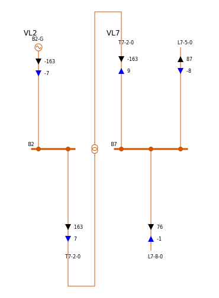

===============
Getting started
===============

.. testsetup:: *

    import pandas as pd
    pd.options.display.max_columns = None
    pd.options.display.expand_frame_repr = False

Installation
------------

You can simply install released versions of pypowsybl from
`PyPI <https://pypi.org/project/pypowsybl/>`_ using pip:

.. code-block:: bash

   pip install pypowsybl

If you want to build pypowsybl from sources, please check out build
instructions on `github <https://github.com/powsybl/pypowsybl>`_.

Basic usage
-----------

The main data type you will manipulate is the :class:`Network <pypowsybl.network.Network>`,
defined in :mod:`pypowsybl.network` module.

In order to create one, you can use one of the provided creation methods, for example
you can create the well known IEEE 9-bus test case:

.. testcode::

    import pypowsybl.network as pn
    network = pn.create_ieee9()

You can then start inspecting the content of the network,
for example in order to get lines data:

.. doctest::
    :options: +NORMALIZE_WHITESPACE

    >>> network.get_lines()
           name     r      x   g1        b1   g2        b2  p1  q1  i1  p2  q2  i2 voltage_level1_id voltage_level2_id bus1_id bus2_id  connected1  connected2
    id
    L7-8-0       0.85   7.20  0.0  0.000745  0.0  0.000745 NaN NaN NaN NaN NaN NaN               VL2               VL8   VL2_1   VL8_0        True        True
    L9-8-0       1.19  10.08  0.0  0.001045  0.0  0.001045 NaN NaN NaN NaN NaN NaN               VL3               VL8   VL3_1   VL8_0        True        True
    L7-5-0       3.20  16.10  0.0  0.001530  0.0  0.001530 NaN NaN NaN NaN NaN NaN               VL2               VL5   VL2_1   VL5_0        True        True
    L9-6-0       3.90  17.00  0.0  0.001790  0.0  0.001790 NaN NaN NaN NaN NaN NaN               VL3               VL6   VL3_1   VL6_0        True        True
    L5-4-0       1.00   8.50  0.0  0.000880  0.0  0.000880 NaN NaN NaN NaN NaN NaN               VL5               VL1   VL5_0   VL1_1        True        True
    L6-4-0       1.70   9.20  0.0  0.000790  0.0  0.000790 NaN NaN NaN NaN NaN NaN               VL6               VL1   VL6_0   VL1_1        True        True

Each row of the obtained dataframe represents a line of the network.

You may have noticed that the flows are :code:`NaN`. In order to compute them,
you can run a loadflow using the :mod:`pypowsybl.loadflow` module:

.. testcode::

    import pypowsybl.loadflow as lf
    lf.run_ac(network)

Flow values are now available in the lines dataframe:

.. doctest::
    :options: +NORMALIZE_WHITESPACE

    >>> network.get_lines()[['p1', 'p2', 'q1', 'q2']].round(2)
               p1     p2     q1     q2
    id
    L7-8-0  76.38 -75.90  -0.80 -10.70
    L9-8-0  24.18 -24.10   3.12 -24.30
    L7-5-0  86.62 -84.32  -8.38 -11.31
    L9-6-0  60.82 -59.46 -18.07 -13.46
    L5-4-0 -40.68  40.94 -38.69  22.89
    L6-4-0 -30.54  30.70 -16.54   1.03

You can also generate a single line diagram of one of the substations
or voltage level, if you want to visualize the result:

.. code-block::

    >>> network.get_single_line_diagram('S1')

This will produce the following SVG image, which will just display if you run
inside a notebook:

Going further
-------------

For more advanced use cases and topical guides, please check out the :doc:`/user_guide/index`.

For a comprehensive list of features and detailed description of methods,
please check out the :doc:`/reference/index`.
