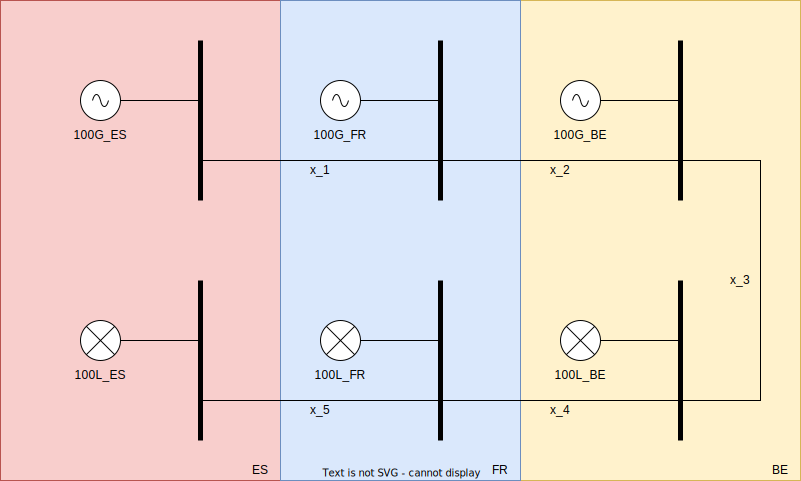
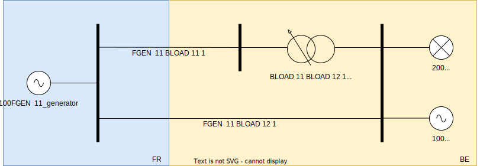

Running a flow decomposition
============================

.. testsetup:: *

    import pathlib
    import pandas as pd

    import pypowsybl as pp
    
    pd.options.display.max_columns = None
    pd.options.display.expand_frame_repr = False
    import os
    cwd = os.getcwd()
    PROJECT_DIR = pathlib.Path(cwd).parent
    DATA_DIR = PROJECT_DIR.joinpath('data')

You can use the module :mod:`pypowsybl.flowdecomposition` in order to run load flows on networks.
Please check out the examples below.

For detailed documentation of involved classes and methods, please refer to the :mod:`API reference <pypowsybl.flowdecomposition>`.

Start by importing the module:

.. code-block:: python

   import pypowsybl as pp

First example
-------------

To perform a flow decomposition, you need at least a network.
The flow decomposition computer returns a dataframe containing the flow decomposition and the reference values.
The reference values are the active power flows in AC on the original network and in DC on the compensated network.
By default, the compensated network is the same as the original network as the loss compensation is not activated by default.
This are toy examples that do not reflect reality.

.. doctest::
    :options: +NORMALIZE_WHITESPACE

    >>> network = pp.network.create_eurostag_tutorial_example1_network()
    >>> flow_decomposition_dataframe = pp.flowdecomposition.run(network)
    >>> flow_decomposition_dataframe
                commercial_flow  pst_flow  loop_flow_from_be  loop_flow_from_fr  ac_reference_flow  dc_reference_flow country1 country2
    branch_id                                                                                                                           
    NHV1_NHV2_1              0.0       0.0              300.0                0.0         302.444049              300.0       FR       BE
    NHV1_NHV2_2              0.0       0.0              300.0                0.0         302.444049              300.0       FR       BE

Loop flows
----------

Here is another example with imbricated zones.
This example will highlight loop flows from the peripheral areas.

    
.. doctest::
    :options: +NORMALIZE_WHITESPACE

    >>> network = pp.network.load(str(DATA_DIR.joinpath('NETWORK_LOOP_FLOW_WITH_COUNTRIES.uct')))
    >>> flow_decomposition_dataframe = pp.flowdecomposition.run(network)
    >>> flow_decomposition_dataframe
                         commercial_flow  pst_flow  loop_flow_from_be  loop_flow_from_es  loop_flow_from_fr  ac_reference_flow  dc_reference_flow country1 country2
    branch_id                                                                                                                                                      
    BLOAD 11 FLOAD 11 1             -0.0       0.0                0.0              100.0              100.0                NaN              200.0       BE       FR
    EGEN  11 FGEN  11 1              0.0       0.0                0.0              100.0                0.0                NaN              100.0       ES       FR
    FGEN  11 BGEN  11 1              0.0       0.0                0.0              100.0              100.0                NaN              200.0       FR       BE
    FLOAD 11 ELOAD 11 1             -0.0       0.0                0.0              100.0                0.0                NaN              100.0       FR       ES

On this example, the AC load flow does not converge.

PST flows
---------

Network details
^^^^^^^^^^^^^^^

Here is another example with a more complex network containing a phase-shifting transformer (PST).
This PST has a non neutral tap position, thus forcing the flows in a certain direction.
This example illustrates the flow decomposition with such network element.

As we cannot set a PST on an interconnexion, we set an equivalent null load called 'BLOAD 11'.

.. doctest::
    :options: +NORMALIZE_WHITESPACE

    >>> network = pp.network.load(str(DATA_DIR.joinpath('NETWORK_PST_FLOW_WITH_COUNTRIES.uct')))
    >>> network.get_generators()
                           name energy_source  target_p   min_p   max_p   min_q   max_q reactive_limits_kind  target_v  target_q  voltage_regulator_on regulated_element_id   p   q   i voltage_level_id     bus_id  connected
    id                                                                                                                                                                                                                    
    FGEN  11_generator              OTHER     100.0 -1000.0  1000.0 -1000.0  1000.0              MIN_MAX     400.0       0.0                  True                      NaN NaN NaN          FGEN  1  FGEN  1_0       True
    BLOAD 12_generator              OTHER     100.0 -1000.0  1000.0 -1000.0  1000.0              MIN_MAX     400.0       0.0                  True                      NaN NaN NaN          BLOAD 1  BLOAD 1_1       True
    >>> network.get_loads()
                      name       type     p0   q0   p   q   i voltage_level_id     bus_id  connected
    id                                                                                          
    BLOAD 12_load       UNDEFINED  200.0  0.0 NaN NaN NaN          BLOAD 1  BLOAD 1_1       True
    >>> network.get_lines()
                            name    r    x   g1   b1   g2   b2  p1  q1  i1  p2  q2  i2 voltage_level1_id voltage_level2_id    bus1_id    bus2_id  connected1  connected2
    id                                                                                                                                                              
    FGEN  11 BLOAD 12 1       0.5  1.5  0.0  0.0  0.0  0.0 NaN NaN NaN NaN NaN NaN           FGEN  1           BLOAD 1  FGEN  1_0  BLOAD 1_1        True        True
    FGEN  11 BLOAD 11 1       1.0  3.0  0.0  0.0  0.0  0.0 NaN NaN NaN NaN NaN NaN           FGEN  1           BLOAD 1  FGEN  1_0  BLOAD 1_0        True        True
    >>> network.get_buses()
                  name  v_mag  v_angle  connected_component  synchronous_component voltage_level_id
    id                                                                                         
    FGEN  1_0         NaN      NaN                    0                      0          FGEN  1
    BLOAD 1_0         NaN      NaN                    0                      0          BLOAD 1
    BLOAD 1_1         NaN      NaN                    0                      0          BLOAD 1
    >>> network.get_2_windings_transformers()
                            name    r    x       g        b  rated_u1  rated_u2  rated_s  p1  q1  i1  p2  q2  i2 voltage_level1_id voltage_level2_id    bus1_id    bus2_id  connected1  connected2
    id                                                                                                                                                                                        
    BLOAD 11 BLOAD 12 2       0.5  1.5  0.0002  0.00015     400.0     400.0      NaN NaN NaN NaN NaN NaN NaN           BLOAD 1           BLOAD 1  BLOAD 1_1  BLOAD 1_0        True        True
    >>> network.get_phase_tap_changers()
                             tap  low_tap  high_tap  step_count  regulating regulation_mode  regulation_value  target_deadband regulating_bus_id
    id                                                                                                                                      
    BLOAD 11 BLOAD 12 2    0      -16        16          33       False       FIXED_TAP               NaN              NaN  
    
Neutral tap position
^^^^^^^^^^^^^^^^^^^^

Here are the results with neutral tap position.

.. doctest::
    :options: +NORMALIZE_WHITESPACE

    >>> flow_decomposition_dataframe = pp.flowdecomposition.run(network)
    >>> flow_decomposition_dataframe
                             commercial_flow  pst_flow  loop_flow_from_be  loop_flow_from_fr  ac_reference_flow  dc_reference_flow country1 country2
    branch_id                                                                                                                                   
    FGEN  11 BLOAD 11 1        28.999015      -0.0          -1.999508          -1.999508          29.003009               25.0       FR       BE
    FGEN  11 BLOAD 12 1        86.997046       0.0          -5.998523          -5.998523          87.009112               75.0       FR       BE
    >>> flow_decomposition_dataframe[[c for c in flow_decomposition_dataframe.columns if ("reference" not in c and "country" not in c)]].sum(axis=1)
    branch_id                  
    FGEN  11 BLOAD 11 1    25.0
    FGEN  11 BLOAD 12 1    75.0
    dtype: float64

The results are not rescaled to the AC reference by default.

Non neutral tap position
^^^^^^^^^^^^^^^^^^^^^^^^

Here are the results with non-neutral tap position.

.. doctest::
    :options: +NORMALIZE_WHITESPACE

    >>> network = pp.network.load(str(DATA_DIR.joinpath('NETWORK_PST_FLOW_WITH_COUNTRIES.uct')))
    >>> network.update_phase_tap_changers(id="BLOAD 11 BLOAD 12 2", tap=1)
    >>> network.get_phase_tap_changers()
                             tap  low_tap  high_tap  step_count  regulating regulation_mode  regulation_value  target_deadband regulating_bus_id
    id                                                                                                                                      
    BLOAD 11 BLOAD 12 2    1      -16        16          33       False       FIXED_TAP               NaN              NaN                  
    >>> flow_decomposition_dataframe = pp.flowdecomposition.run(network)
    >>> flow_decomposition_dataframe
                             commercial_flow    pst_flow  loop_flow_from_be  loop_flow_from_fr  ac_reference_flow  dc_reference_flow country1 country2
    branch_id                                                                                                                                     
    FGEN  11 BLOAD 11 1        29.015809  163.652703          -2.007905          -2.007905         192.390656         188.652703       FR       BE
    FGEN  11 BLOAD 12 1       -87.047428  163.652703           6.023714           6.023714         -76.189072         -88.652703       FR       BE
    >>> flow_decomposition_dataframe[[c for c in flow_decomposition_dataframe.columns if ("reference" not in c and "country" not in c)]].sum(axis=1)
    branch_id                  
    FGEN  11 BLOAD 11 1    188.652703
    FGEN  11 BLOAD 12 1     88.652703
    dtype: float64

Note that the reference flow on the 2d branch has change of sign. 
As we use it as reference, all the decomposed flows have also changed of sign.

Configuration file 
------------------

Inside your config.yml file, you can change the default Configuration of the flow decomposition.
Here are the available parameters and their default values:

.. doctest::
    :options: +NORMALIZE_WHITESPACE

    flow-decomposition-default-parameters:
        save-intermediates: False
        enable-losses-compensation: False
        losses-compensation-epsilon: 1e-5
        sensitivity-epsilon: 1e-5
        rescale-enabled: False
