Network visualization
=====================

Single line diagram
-------------------

To create a single line diagram in SVG format from a substation or a voltage level:

.. code-block:: python

    >>> network = pp.network.create_ieee14()
    >>> network.write_single_line_diagram_svg('VL4', 'vl4.svg')

Or in a Jupyter notebook, the SVG can be directly rendered in the notebook:

.. code-block:: python

    >>> network.get_single_line_diagram('VL4')

Note that a loadflow can be run before writing the diagram so that it displays reactive and active powers:

.. code-block:: python

    >>> network = pp.network.create_ieee14()
    >>> result = pp.loadflow.run_ac(network)
    >>> network.write_single_line_diagram_svg('VL4', 'vl4.svg')

.. image:: ../_static/images/ieee14_vl4.svg

It is also possible to display a multi-substation single line diagram (currently a beta feature):

.. code-block:: python

    >>> network = pp.network.create_ieee14()
    >>> result = pp.loadflow.run_ac(network)
    >>> network.write_matrix_multi_substation_single_line_diagram_svg([['S1', 'S2'],['S3','S4']], 's1_s2_s3_s4.svg')

.. image:: ../_static/images/ieee14_s1_s2_s3_s4.svg

Network area diagram
--------------------

To create a network area diagram in SVG format for the full network:

.. code-block:: python

    >>> network = pp.network.create_ieee9()
    >>> network.write_network_area_diagram_svg('ieee9.svg')

Or in a Jupyter notebook, the SVG can be directly rendered in the notebook:

.. code-block:: python

    >>> network.get_network_area_diagram()

To render only a part of the network, we can specify a voltage level ID as the center of the sub network and a depth
to control the size of the sub network:

.. code-block:: python

    >>> network = pp.network.create_ieee300()
    >>> network.write_network_area_diagram_svg('ieee300.svg', 'VL1', 1)

Nominal voltage bounds can be defined to further filter the output network:

.. code-block:: python

    >>> network = pp.network.create_ieee300()
    >>> network.write_network_area_diagram_svg('ieee300.svg', 'VL1', 1, low_nominal_voltage_bound=90, high_nominal_voltage_bound=240)

If no voltage level ID is given as an input, only nominal voltage bounds are used to filter the network:

.. code-block:: python

    >>> network = pp.network.create_ieee30()
    >>> network.write_network_area_diagram_svg('ieee30.svg', low_nominal_voltage_bound=90, high_nominal_voltage_bound=240)

Note that similarly to single-line diagrams, a loadflow can be run before writing the diagram so that it displays active powers, for instance:

.. code-block:: python

    >>> network = pp.network.create_ieee9()
    >>> result = pp.loadflow.run_ac(network)
    >>> network.write_network_area_diagram_svg('ieee9.svg')

Network-area diagrams can be customized through NadParameters:

.. code-block:: python

    >>> network = pp.network.create_ieee14()
    >>> nad = network.get_network_area_diagram('VL6', nad_parameters=NadParameters(edge_name_displayed=True, id_displayed=True, edge_info_along_edge=False, power_value_precision=1, angle_value_precision=0, current_value_precision=1, voltage_value_precision=0, bus_legend=False, substation_description_displayed=True))

    - edge_name_displayed: if true, names along lines and transformer legs are displayed (default value false)
    - id_displayed: if true, the equipment ids are displayed. If false, the equipment names are displayed (if a name is null, then the id is displayed) (default value false)
    - edge_info_along_edge: if true, the edge information (P or Q values for example) is displayed alongside the edge. If false, the edge information is displayed perpendicularly to the edge (default value true)
    - power_value_precision: number of digits after the decimal point for power values (default value 0)
    - angle_value_precision: number of digits after the decimal point for angle values (default value 1)
    - current_value_precision: number of digits after the decimal point for current values (default value 0)
    - voltage_value_precision: number of digits after the decimal point for voltage values(default value 1)
    - bus_legend: if true, angle and voltage values associated to a voltage level are displayed in a text box. If false, only the voltage level name is displayed (default value true)
    - substation_description_displayed: if true, the substation name is added to the voltage level info on the diagram (default value false)

In order to get a list of the displayed voltage levels from an input voltage level (or an input list of voltage levels) and a depth:

.. code-block:: python

    >>> network = pp.network.create_ieee300()
    >>> list_vl = network.get_network_area_diagram_displayed_voltage_levels('VL1', 1)