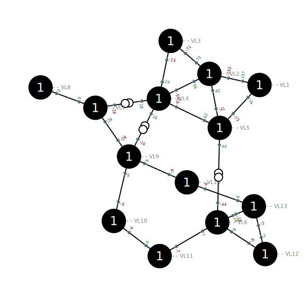
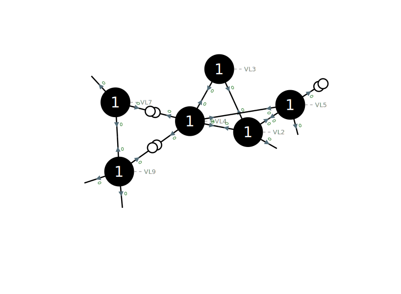

Network visualization
=====================

Single line diagram
-------------------

To create a single line diagram in SVG format from a substation or a voltage level:

.. code-block:: python

    >>> network = pp.network.create_ieee14()
    >>> network.write_single_line_diagram_svg('VL4', 'vl4.svg')

Or in a Jupyter notebook, the SVG can be directly rendered in the notebook:

.. code-block:: python

    >>> network.get_single_line_diagram_svg('VL4')

.. image:: ../_static/images/ieee14_vl4.svg

Network area diagram
--------------------

To create a network area diagram in SVG format for the full network:

.. code-block:: python

    >>> network = pp.network.create_ieee14()
    >>> network.write_network_area_diagram_svg('ieee14.svg')

Or in a Jupyter notebook, the SVG can be directly rendered in the notebook:

.. code-block:: python

    >>> network.get_network_area_diagram_svg()

To render only a part of the network, we can specify a voltage level ID as the center of the sub network and a depth
to control the size of the sub network:

.. code-block:: python

    >>> network = pp.network.create_ieee14()
    >>> network.write_network_area_diagram_svg('ieee14.svg', 'VL4', 1)

