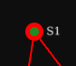

Network visualization
=====================

Single line diagram
-------------------

To create a single line diagram in SVG format from a substation or a voltage level:

.. code-block:: python

    >>> network = pp.network.create_ieee14()
    >>> network.write_single_line_diagram_svg('VL4', 'vl4.svg')

Or in a Jupyter notebook, the SVG can be directly rendered in the notebook:

.. code-block:: python

    >>> network.get_single_line_diagram('VL4')

Note that a loadflow can be run before writing the diagram so that it displays reactive and active powers:

.. code-block:: python

    >>> network = pp.network.create_ieee14()
    >>> result = pp.loadflow.run_ac(network)
    >>> network.write_single_line_diagram_svg('VL4', 'vl4.svg')

.. image:: ../_static/images/ieee14_vl4.svg
   :class: forced-white-background

Single-line diagrams can be customized through SldParameters:

.. code-block:: python

    >>> network = pp.network.create_ieee14()
    >>> result = pp.loadflow.run_ac(network)
    >>> network.get_single_line_diagram('VL4',parameters = pp.network.SldParameters(use_name = False, center_name = False, diagonal_label = False, nodes_infos = False, tooltip_enabled = False, topological_coloring = True, component_library = 'Convergence'))

- use_name: if true, display components names instead of their id (default value false)
- center_name: if true, center the names of feeders (default value false)
- diagonal_label: if true, display labels diagonally (default value false)
- nodes_infos: if true, display nodes infos (caption on bottom left) (default value false)
- tooltip_enabled: if true, display the name of the component pointed by the cursor (default value false)
- topological_coloring: if true, set each electrical nodes with a different colour (default value true)
- component_library: choose component library (default value 'Convergence')
- active_power_unit: display unit of active power (default value "")
- reactive_power_unit: display unit of reactive power (default value "")
- current_unit: display unit of current (default value "")
- display_current_feeder_info: if true, display current feeder value (default value False)

Let's see some examples down below:

- with default parameters

.. code-block:: python

    >>> import pypowsybl.network as pn
    >>> param = pn.SldParameters() #default parameters
    >>> network.get_single_line_diagram('VL4', parameters = param)

.. image:: ../_static/images/ieee14_SldParam_default.svg
   :class: forced-white-background

- with use_name = True

.. code-block:: python

    >>> param = pn.SldParameters(use_name = True)
    >>> network.get_single_line_diagram('VL4', parameters = param)

.. image:: ../_static/images/ieee14_SldParam_usename.svg
   :class: forced-white-background

- with center_name = True

.. code-block:: python

    >>> param = pn.SldParameters(center_name = True)
    >>> network.get_single_line_diagram('VL4', parameters = param)

.. image:: ../_static/images/ieee14_SldParam_centername.svg
   :class: forced-white-background

- with diagonal_label = True

.. code-block:: python

    >>> param = pn.SldParameters(diagonal_label = True)
    >>> network.get_single_line_diagram('VL4', parameters = param)

.. image:: ../_static/images/ieee14_SldParam_diagonallabel.svg
   :class: forced-white-background

- with nodes_infos = True

.. code-block:: python

    >>> param = pn.SldParameters(nodes_infos = True)
    >>> network.get_single_line_diagram('VL4', parameters = param)

.. image:: ../_static/images/ieee14_SldParam_nodesinfos.svg
   :class: forced-white-background

- with tooltip_enabled = True

.. code-block:: python

    >>> param = pn.SldParameters(tooltip_enabled = True)
    >>> network.get_single_line_diagram('VL4', parameters = param)

- with topological_coloring = True

.. code-block:: python

    >>> network = pn.create_four_substations_node_breaker_network()
    >>> network.update_switches(id="S1VL2_COUPLER",open=True)
    >>> param = pn.SldParameters(topological_coloring = True)
    >>> network.get_single_line_diagram('S1VL2', parameters = param)

.. image:: ../_static/images/SldParam_topologicalcoloringtrue.svg
   :class: forced-white-background

- with topological_coloring = False

.. code-block:: python

    >>> param = pn.SldParameters(topological_coloring = False)
    >>> network.get_single_line_diagram('S1VL2', parameters = param)

.. image:: ../_static/images/SldParam_topologicalcoloringfalse.svg
   :class: forced-white-background

- with component_library = "FlatDesign"

.. code-block:: python

    >>> network = pn.create_ieee14()
    >>> param = pn.SldParameters(component_library = "FlatDesign")
    >>> network.get_single_line_diagram('VL4', parameters = param)

.. image:: ../_static/images/ieee14_SldParam_complib_flatdesign.svg
   :class: forced-white-background

- with display_current_feeder_info = True

.. code-block:: python

    >>> param = pn.SldParameters(display_current_feeder_info = True)
    >>> network.get_single_line_diagram('VL4', parameters = param)

.. image:: ../_static/images/ieee14_SldParam_displaycurrentfeederinfo.svg
   :class: forced-white-background

- with active_power_unit = "MW"

.. code-block:: python

    >>> param = pn.SldParameters(active_power_unit = "MW")
    >>> network.get_single_line_diagram('VL4', parameters = param)

.. image:: ../_static/images/ieee14_SldParam_activepowerunit.svg
   :class: forced-white-background

- with reactive_power_unit = "MVAR"

.. code-block:: python

    >>> param = pn.SldParameters(reactive_power_unit = "MVAR")
    >>> network.get_single_line_diagram('VL4', parameters = param)

.. image:: ../_static/images/ieee14_SldParam_reactivepowerunit.svg
   :class: forced-white-background

- with current_unit = "A"

.. code-block:: python

    >>> param = pn.SldParameters(display_current_feeder_info = True, current_unit = "A")
    >>> network.get_single_line_diagram('VL4', parameters = param)

.. image:: ../_static/images/ieee14_SldParam_currentunit.svg
   :class: forced-white-background

It is also possible to display a multi-substation single line diagram (currently a beta feature):

.. code-block:: python

    >>> network = pp.network.create_ieee14()
    >>> result = pp.loadflow.run_ac(network)
    >>> network.write_matrix_multi_substation_single_line_diagram_svg([['S1', 'S2'],['S3','S4']], 's1_s2_s3_s4.svg')

.. image:: ../_static/images/ieee14_s1_s2_s3_s4.svg
   :class: forced-white-background

Or in a Jupyter Notebook:

.. code-block:: python

    >>> network.get_matrix_multi_substation_single_line_diagram([['S1', 'S2'],['S3','S4']])

The substation diagrams will be arranged in a grid, based on the content of the matrix parameter. An empty string in the matrix will result in an empty spot in the grid.

Network area diagram
--------------------

To create a network area diagram in SVG format for the full network:

.. code-block:: python

    >>> network = pp.network.create_ieee9()
    >>> network.write_network_area_diagram_svg('ieee9.svg')

Or in a Jupyter notebook, the SVG can be directly rendered in the notebook:

.. code-block:: python

    >>> network.get_network_area_diagram()

To render only a part of the network, we can specify a voltage level ID as the center of the sub network and a depth
to control the size of the sub network:

.. code-block:: python

    >>> network = pp.network.create_ieee300()
    >>> network.write_network_area_diagram_svg('ieee300.svg', 'VL1', 1)

.. image:: ../_static/images/ieee300_subnetwork_vl1.svg
   :class: forced-white-background

Nominal voltage bounds can be defined to further filter the output network:

.. code-block:: python

    >>> network = pp.network.create_ieee300()
    >>> network.write_network_area_diagram_svg('ieee300.svg', 'VL1', 1, low_nominal_voltage_bound=90, high_nominal_voltage_bound=240)

.. image:: ../_static/images/ieee300_subnetwork_vl1_filtered.svg
   :class: forced-white-background

If no voltage level ID is given as an input, only nominal voltage bounds are used to filter the network:

.. code-block:: python

    >>> network = pp.network.create_ieee30()
    >>> network.write_network_area_diagram_svg('ieee30.svg', low_nominal_voltage_bound=90, high_nominal_voltage_bound=240)

.. image:: ../_static/images/ieee30_subnetwork_filtered_no_vl_id.svg
   :class: forced-white-background

Note that similarly to single-line diagrams, a loadflow can be run before writing the diagram so that it displays active powers, for instance:

.. code-block:: python

    >>> network = pp.network.create_ieee9()
    >>> result = pp.loadflow.run_ac(network)
    >>> network.write_network_area_diagram_svg('ieee9.svg')

Network-area diagrams can be customized through NadParameters:

.. code-block:: python

    >>> from pypowsybl.network import NadParameters
    >>> network = pp.network.create_ieee14()
    >>> nad = network.get_network_area_diagram('VL6', nad_parameters=NadParameters(edge_name_displayed=True, id_displayed=True, edge_info_along_edge=False, power_value_precision=1, angle_value_precision=0, current_value_precision=1, voltage_value_precision=0, bus_legend=False, substation_description_displayed=True, edge_info_displayed=EdgeInfoType.REACTIVE_POWER))

    - edge_name_displayed: if true, names along lines and transformer legs are displayed (default value false)
    - id_displayed: if true, the equipment ids are displayed. If false, the equipment names are displayed (if a name is null, then the id is displayed) (default value false)
    - edge_info_along_edge: if true, the edge information (P or Q values for example) is displayed alongside the edge. If false, the edge information is displayed perpendicularly to the edge (default value true)
    - power_value_precision: number of digits after the decimal point for power values (default value 0)
    - angle_value_precision: number of digits after the decimal point for angle values (default value 1)
    - current_value_precision: number of digits after the decimal point for current values (default value 0)
    - voltage_value_precision: number of digits after the decimal point for voltage values(default value 1)
    - bus_legend: if true, angle and voltage values associated to a voltage level are displayed in a text box. If false, only the voltage level name is displayed (default value true)
    - substation_description_displayed: if true, the substation name is added to the voltage level info on the diagram (default value false)
    - edge_info_displayed: type of info displayed (EdgeInfoType.ACTIVE_POWER(default),EdgeInfoType.REACTIVE_POWER or EdgeInfoType.CURRENT)

In order to get a list of the displayed voltage levels from an input voltage level (or an input list of voltage levels) and a depth:

.. code-block:: python

    >>> network = pp.network.create_ieee300()
    >>> list_vl = network.get_network_area_diagram_displayed_voltage_levels('VL1', 1)

We can generate a network area diagram using fixed positions, defined in a dataframe:

.. code-block:: python

    >>> import pandas as pd
    >>> network = pp.network.create_ieee9()
    >>> pos_df = pd.DataFrame.from_records(index='id',
                                           columns=['id', 'x', 'y', 
                                                    'legend_shift_x', 'legend_shift_y', 'legend_connection_shift_x', 'legend_connection_shift_y'], 
                                           data=[
                                               ('VL5',  10.0, 20.0, 80.0, -30, 80.0, 0),
                                               ('VL6', 400.0, 20.0, 80.0, -30, 80.0, 0),
                                               ('VL8', 800.0, 20.0, 80.0, -30, 80.0, 0)
                                           ])
    >>> nad = network.get_network_area_diagram(fixed_positions=pos_df)

In the dataframe:

- id is the equipment id for the node
- x, y define the position for the node
- legend_shift_x, legend_shift_y define the legend box top-left position (relative to the node position)
- legend_connection_shift_x, legend_connection_shift_y define the legend box side endpoint position (relative to the node position) for the segment connecting a node and its legend box

The optional parameter fixed_positions can also be set in the write_network_area_diagram function.
Note that positions for elements not included in the dataframe are computed using the current layout algorithm.

We can further customize the NAD diagram using the NadProfile. For example, to set
   - the labels for the branches, and the arrows direction
   - the VL and BUS descriptions in the VL info boxes

by using dataframes:

.. code-block:: python

    >>> import pandas as pd
    >>> network = pp.network.create_four_substations_node_breaker_network()
    >>> labels_df = pd.DataFrame.from_records(index='id', columns=['id', 'side1', 'middle', 'side2', 'arrow1', 'arrow2'],
                                              data=[
                                                  ('LINE_S2S3', 'L1_1', 'L1', 'L1_2', 'IN', 'IN'),
                                                  ('LINE_S3S4', 'L2_1', 'L2', 'L2_2', 'OUT', 'IN'),
                                                  ('TWT', 'TWT1_1', 'TWT1', 'TWT1_2', None, 'OUT')
                                              ])
    >>> vl_descriptions_df=pd.DataFrame.from_records(index='id',
                                              data=[
                                                 {'id': 'S1VL1', 'type': 'HEADER', 'description': 'VL A'},
                                                 {'id': 'S1VL1', 'type': 'FOOTER', 'description': 'VL A footer'},
                                                 {'id': 'S1VL2', 'type': 'HEADER', 'description': 'VL B'},
                                                 {'id': 'S2VL1', 'type': 'HEADER', 'description': 'VL C'},
                                                 {'id': 'S3VL1', 'type': 'HEADER', 'description': 'VL D'},
                                                 {'id': 'S3VL1', 'type': 'FOOTER', 'description': 'VL D footer'}
                                              ])
    >>> bus_descriptions_df=pd.DataFrame.from_records(index='id',
                                              data=[
                                                  {'id': 'S1VL1_0', 'description': 'BUS A'},
                                                  {'id': 'S1VL2_0', 'description': 'BUS B'},
                                                  {'id': 'S2VL1_0', 'description': 'BUS C'},
                                                  {'id': 'S3VL1_0', 'description': 'BUS D'}
                                              ])
    >>> diagram_profile=pp.network.NadProfile(branch_labels=labels_df, vl_descriptions=vl_descriptions_df, bus_descriptions=bus_descriptions_df)
    >>> pars=pp.network.NadParameters(edge_name_displayed=True)
    >>> network.get_network_area_diagram(voltage_level_ids='S1VL1', depth=2, nad_parameters=pars, nad_profile=diagram_profile)

In the branch_labels dataframe parameter:
    - id is the branch id
    - side1 and side2 define the labels along the two branch's edges
    - middle defines the branch's label
    - arrow1 and arrow2 define the direction of the arrows at the ends of the branch: 'IN' or 'OUT'. None (or an empty string) does not display the arrow.

In the vl_descriptions dataframe parameter:
    - id is the VL id
    - type: 'HEADER' or 'FOOTER' determines if the descrtiption appears above or below the bus description, in the VL info box
    - description define a label for the VL. Entries with the same VL id are displayed sequentially as multiple rows

In the bus_descriptions dataframe parameter:
    - id is the BUS id
    - description define a label for the BUS

An additional three_wt_labels dataframe parameter can be used to set the labels and the arrows direction for three winding transformers:
    - id is the three winding transformer id
    - side1, side2, and side3 define the labels along the three winding transformer legs
    - arrow1, arrow2, and arrow3 define the direction of the arrows at the ends of the three winding transformer legs: 'IN' or 'OUT'. None (or an empty string) does not display the arrow.

The optional parameter nad_profile can also be set in the write_network_area_diagram function.

Network area diagram using geographical data
--------------------------------------------

We can load a network with geographical data (in WGS84 coordinates system) for substations and lines (in that case,
the geographical positions represent the line path). One way to do that is to load a CGMES file containing
a GL profile (Graphical Layout). By default this profile is not read. To activate GL profile loading and
creation of substations ans lines geographical positions in the PowSyBl network model we have to pass an
additional parameter to the load function.

.. code-block:: python

    >>> network = pp.network.load('MicroGridTestConfiguration_T4_BE_BB_Complete_v2.zip', {'iidm.import.cgmes.post-processors': 'cgmesGLImport'})

We can now check loaded position by displaying `SubstationPosition` and `LinePosition` extensions.

.. code-block:: python

    >>> network.get_extension('substationPosition')
                                      latitude  longitude
    id
    87f7002b-056f-4a6a-a872-1744eea757e3   51.3251    4.25926
    37e14a0f-5e34-4647-a062-8bfd9305fa9d   50.8038    4.30089

.. code-block:: python

    >>> network.get_extension('linePosition')
                                          latitude  longitude
    id                                   num
    b58bf21a-096a-4dae-9a01-3f03b60c24c7 0     50.8035    4.30113
                                         1     50.9169    4.34509
                                         2     51.0448    4.29565
                                         3     51.1570    4.38354
                                         4     51.3251    4.25926
    ffbabc27-1ccd-4fdc-b037-e341706c8d29 0     50.8035    4.30113
                                         1     50.9169    4.34509
                                         2     51.0448    4.29565
                                         3     51.1570    4.38354
                                         4     51.3251    4.25926

When we generate a network area diagram, an automatic force layout is performed by default.
The diagram looks like this:

.. code-block:: python

    >>> network.write_network_area_diagram('be.svg')

Now that we have geographical positions in our data model, we can change the layout to render the diagram with
the geographical layout:

.. code-block:: python

    >>> parameter = pp.network.NadParameters(layout_type=pp.network.NadLayoutType.GEOGRAPHICAL)
    >>> network.write_network_area_diagram('be.svg', nad_parameters=parameter)

Display diagrams using Jupyter widgets
--------------------------------------------
You can also display diagrams through `Jupyter widgets <https://github.com/powsybl/pypowsybl-jupyter>`_.

Get a handle on Jupyter widgets
~~~~~~~~~~~~~~~~~~~~~~~~~~~~~~~~~~~~~~~~~~~~

You can use the explorer to check the example notebooks given in the `pypowsybl-jupyter repository <https://github.com/powsybl/pypowsybl-jupyter/tree/main/examples>`_:

.. code-block:: bash

    pip install pypowsybl_jupyter
    jupyter lab

The network_explorer features three tabs:

* A tab for network-area diagrams;

* A tab for single-line diagrams;

* A tab for a map viewer.

Explore the network_explorer tabs
~~~~~~~~~~~~~~~~~~~~~~~~~~~~~~~~~~~~~~~~~~~~

- **The network-area diagram tab**

.. image:: ../_static/images/explorer_nad.png

The network-area diagram tab displays the network-area diagram of the selected voltage level in the left column at the desired depth.
The depth is user-defined, thanks to the slide button above the display zone.

- **The single-line diagram tab**

The single-line diagram tab displays the single-line diagram of the selected voltage level in the left column.
You can navigate from voltage level to voltage level using the circled arrows.

- **The map viewer tab**

The map viewer tab displays a geographical representation of the network with a background map.
The vertices of the graph are substations and the edges are lines, tie lines or HVDC lines.
Voltage levels are represented as concentric circles inside a substation:

Selecting a voltage level on the left column will center the map on the corresponding substation.

Users can filter the displayed voltage levels through a nominal voltage filter. By default, only higher nominal voltages are selected.

Please note that if no geographical extensions are available for substations, the tab will be blank.

Go further
~~~~~~~~~~~~~~~~~~~~~~~~~~~~~~~~~~~~~~~~~~~~

Check the complete documentation available on the widgets `here <https://powsybl.readthedocs.io/projects/pypowsybl-jupyter>`_.

